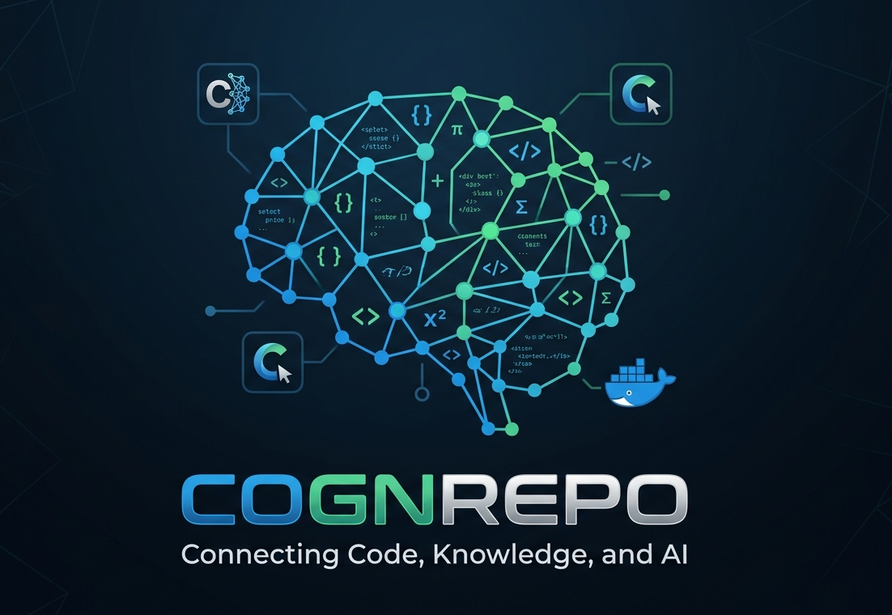
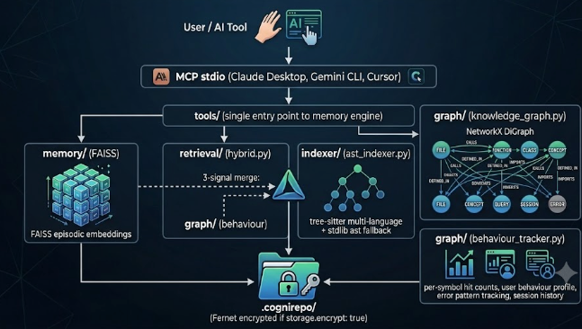

# CogniRepo

mcp-name: io.github.ashlesh-t/cognirepo
> Persistent memory and context for any AI tool. Not a chatbot — infrastructure.

[](https://github.com/ashlesh-t/cognirepo/actions/workflows/ci.yml)
[](https://github.com/ashlesh-t/cognirepo/actions/workflows/security.yml)
[](https://badge.fury.io/py/cognirepo)
[](https://github.com/ashlesh-t/cognirepo/stargazers)
[](https://opensource.org/licenses/MIT)
[](https://www.python.org/downloads/)
[](https://discord.com/channels/1488386981917360289/1488387271190380636)



---

**`lookup_symbol` returns file:line very quickly — grep takes 2–8 seconds.** On Python repos ≥ 15K LOC, CogniRepo cuts AI coding agent token usage by **50–80%** compared to raw file reads — benchmarked on Flask, FastAPI, Celery, and Ansible (1,800+ files). Works with Claude Code, Cursor, and Gemini CLI. **Fully offline. No API keys required for indexing or any of the 34 MCP tools.**

---

## What it does

Every AI conversation starts from zero. Claude, Cursor, Gemini — none of them remember
what you fixed yesterday, which files relate to which features, or what decisions were made
last sprint. CogniRepo fixes that.

It sits between your codebase and any AI tool, providing:

- **Semantic memory** — FAISS vector store with sentence-transformer embeddings. Store
  decisions, docs, architecture notes. Retrieve them with natural language.
- **Episodic log** — append-only event journal. Know what happened before that error.
- **Knowledge graph** — NetworkX DiGraph linking functions, classes, files, imports,
  inheritance chains, call relationships, and concepts. All queryable.
- **AST reverse index** — O(1) symbol lookup across your entire codebase in any supported language.
- **User behavior profiling** — tracks how you prompt so Claude adapts its response
  style without you having to re-explain preferences every session.
- **Error tracking** — records errors with prevention hints so Claude avoids
  repeating the same mistake across sessions.
- **Session history** — persists conversation exchanges so any session can resume
  where the last one ended.
- **Architectural summaries** — auto-generated on first init; built entirely from
  the local AST index (no API key needed). File → directory → repo summary tree,
  embedded into FAISS for semantic search.
- **Multi-model orchestration** — classify query complexity → build context → route to the
  right model. Claude for deep reasoning, Gemini Flash for quick lookups. All automatic.

Every AI tool that connects gets the same accumulated project knowledge. Memory persists
across sessions, across tools, across time.

---

## When to use CogniRepo

**Most effective on codebases ≥ 15K LOC.** On small repos (< 10K LOC), native file reads
are fast enough that the MCP tool schema overhead (~4,100 tokens for 34 tools) takes more
than you save. Break-even is roughly 4 tool calls on a medium-sized repo.

**CogniRepo vs. claude-context / similar tools:**

| Feature | CogniRepo | claude-context / similar |
|---------|-----------|--------------------------|
| Pure code retrieval | ✓ (FAISS + graph + AST) | ✓ Often faster on first use |
| Episodic memory (what happened last sprint) | ✓ Persistent BM25 + vector | ✗ |
| Cross-agent handoff (Claude → Gemini → Cursor) | ✓ `last_context.json` shared | ✗ |
| User behaviour profile (adapts depth/style) | ✓ `get_user_profile()` | ✗ |
| Error pattern avoidance (learns from past fails) | ✓ `record_error()` | ✗ |
| Architectural decision records | ✓ `record_decision()` | ✗ |
| Multi-repo org graph (microservices) | ✓ `CHILD_OF` / `CALLS_API` edges | ✗ |

**Conclusion:** prefer CogniRepo when you value institutional memory across sessions.
Use simpler tools when you just need one-shot code retrieval on a small codebase.

---

## Why it helps — measured numbers

Benchmarked across 6 real open-source repos (FastAPI, Flask, Celery, Ansible, Moby/Docker, Kubernetes) using 30 structured prompts tested against Claude, Gemini, and Cursor/Codex.

| Metric | Value | Notes |
|--------|-------|-------|
| Token reduction — Python repos | **50–84%** | FastAPI FA-2: 12 000 → 2 500 · FA-4: 2 000 → 450 · FL-4: 8 000 → 1 250 |
| Token reduction — average (all tested) | **~60%** | Across FA/FL/CE/AN where both baselines were captured |
| Token reduction — complex dynamic codebases | **20–35%** | Celery CE-4/CE-5; deep async/dynamic-dispatch patterns reduce gains |
| Symbol lookup latency | **< 1 ms** | vs. `grep` at 2–8 s on large repos |
| Accuracy vs. baseline | **equal or better in 100% of tests** | No regression observed; FA-2 accuracy improved Moderate → High |
| Cross-agent context handoff | **✅ validated** | CE-4: Claude primed index, Gemini CLI consumed it — 35% token saving, same accuracy |
| Dynamic dispatch coverage | **honest gap** | CE-3 (APScheduler beat dispatch) returned NA for both; CogniRepo does not fabricate call chains |
| Go/multi-language coverage | **partial** | Moby MO-2 showed 67% savings; MO-3-5 / K8-* incomplete pending Go grammar improvements |

> **Honest limits:** CogniRepo adds the most value on Python repos with clear static structure.
> Dynamic dispatch patterns (Celery beat, plugin registries), deep Go codebases, and Ansible's
> 22-level variable precedence chains reduce retrieval confidence. The tool reports uncertainty
> rather than hallucinating call chains.

### Measured: lookup latency and token reduction (4 external repos)

Indexed 4 real repos, measured with `cognirepo index-repo` + `cognirepo benchmark --json`. CPU-only, no GPU.

| Repo | Files | Lookup latency | Token reduction | context_relevance |
|------|-------|----------------|-----------------|-------------------|
| flask | 83 | 0.005 ms | 97.7% | 21.8% |
| fastapi | 1,122 | 0.002 ms | 98.6% | 36.0% |
| celery | 416 | 0.003 ms | 99.1% | 39.8% |
| ansible | 1,813 | 0.018 ms | — | — |

Lookup latency < 0.1 ms on all repos. Precision@k re-validated after v1.1.3 benchmark fix — see [docs/METRICS.md](docs/METRICS.md) for full numbers and methodology.

Run `cognirepo benchmark` on your own codebase to reproduce. See [docs/METRICS.md](docs/METRICS.md).

---

## How it works



---

## Quick start

### Requirements

- Python 3.11+
- API key (optional — only needed for `cognirepo ask`):
  `ANTHROPIC_API_KEY`, `GEMINI_API_KEY`, `OPENAI_API_KEY`, or `GROK_API_KEY`.
  Indexing, memory, summarization, and all MCP tools work fully offline.

### Install

#### Recommended — pipx (global, one command, works on all distros)

```bash
pipx install cognirepo
```

That's it. `cognirepo setup` handles the rest — it installs optional extras (languages,
security, providers) via `pipx inject` automatically when you enable them in the wizard.

> **Why pipx?** It creates an isolated venv for cognirepo automatically so `fastembed`
> and all deps install cleanly. The `cognirepo` command is then globally available in
> every directory — no per-repo venv needed.
>
> **Arch Linux / Debian 12+ / Ubuntu 24.04+:** Do NOT `pip install` into system Python.
> These distros enforce PEP 668 and block system-wide pip installs. Use pipx.

#### Install pipx first (if needed)

```bash
# Arch Linux
sudo pacman -S python-pipx

# Debian / Ubuntu
sudo apt install pipx

# macOS
brew install pipx

# Any platform (fallback)
pip install pipx --user
```

#### Inside a virtual environment (alternative)

```bash
python -m venv .venv && source .venv/bin/activate
pip install cognirepo
# extras are installed by the setup wizard automatically
```

#### Development install (from source)

```bash
pipx install -e '.[dev,security,languages]'
# or inside a venv: pip install -e '.[dev,security,languages]'
```

> **Note:** CPU-only embeddings are the default (fastembed/ONNX, no PyTorch/CUDA required).
> For GPU: `pipx inject cognirepo 'cognirepo[gpu]'` then install torch separately.

### Run

```bash
# One-command onboarding (init + index + auto-configure MCP for Claude/Cursor/VS Code):
cognirepo setup

# Or step by step:
cognirepo init --no-index     # scaffold .cognirepo/
cognirepo index-repo .        # index your codebase (required before MCP tools work)
cognirepo index-repo . --daemon  # index and run watcher in background

# Check everything is working:
cognirepo status                        # shows symbol count, graph nodes, signal warmth
cognirepo doctor                        # full health check

# Query through multi-model orchestrator:
cognirepo ask "why is auth slow?"

# Manage background watchers:
cognirepo list                          # show all running watcher daemons
cognirepo list -n <PID> --view          # tail the log of a specific watcher
cognirepo list -n <PID> --stop          # stop a watcher
```

> **First-time setup:** `cognirepo init` + `cognirepo index-repo .` must complete before
> MCP tools (`context_pack`, `lookup_symbol`, `who_calls`, etc.) return data.

---

## Connect your AI tools

### Claude Code / Claude Desktop (recommended — project-scoped)

Run `cognirepo init` inside your project — it asks if you want to configure Claude and
automatically writes `.claude/CLAUDE.md` and `.claude/settings.json` with the correct
project-locked connector.

Each project gets its **own isolated connector** named `cognirepo-<project>`:

```json
{
  "mcpServers": {
    "cognirepo-myproject": {
      "command": "cognirepo",
      "args": ["serve", "--project-dir", "/abs/path/to/myproject"],
      "env": {}
    }
  }
}
```

The `--project-dir` flag locks the MCP server to that project's `.cognirepo/` directory.
When Claude has multiple projects open simultaneously, each connector reads only its own
memories — **never mixing data across projects or teams**.

### Cursor / Copilot

```bash
cognirepo export-spec
cp adapters/cursor_mcp_config.json .cursor/mcp.json
# Restart Cursor — CogniRepo tools appear in the tool selector
```

### Docker

```bash
cp .env.example .env          # add your API keys
docker compose up mcp         # MCP stdio server
```

---

## MCP Tools — complete reference

All 34 tools are available to Claude, Cursor, and any MCP-compatible client.

### Core retrieval

| Tool | Description | When to use |
|------|-------------|-------------|
| `context_pack(query, max_tokens=2000)` | Token-budget code + memory context | Every session — FIRST call before any file read |
| `lookup_symbol(name)` | O(1) symbol lookup → file + line | Before grepping for a function |
| `who_calls(function_name)` | Trace callers + dynamic dispatch fallback | Impact analysis, refactoring |
| `search_token(word)` | Word-level reverse index across names, docs, comments | Finding where a concept lives |
| `retrieve_memory(query, top_k=5)` | Semantic similarity search over stored memories | Before answering — pull past context |
| `search_docs(query)` | Full-text search in all `.md` files | Documentation lookups |
| `semantic_search_code(query, language=None)` | Vector search over code symbols only | Code-specific semantic queries |
| `subgraph(entity, depth=2)` | Local knowledge graph neighbourhood | Understand symbol relationships |
| `graph_stats()` | Node/edge count and graph health | Check if graph has data |
| `episodic_search(query, limit=10)` | BM25 keyword search in event history | Find past decisions or incidents |
| `dependency_graph(module, direction="both")` | Import/dependency relationships | Module coupling analysis |
| `explain_change(target, since="7d")` | What changed in a file/function + git cross-ref | Understanding recent changes |
| `architecture_overview(scope="root")` | Pre-computed LLM architectural summaries | Big-picture questions |

### User & session intelligence

| Tool | Description | When to use |
|------|-------------|-------------|
| `get_user_profile()` | User's interaction style: depth pref, question types, vocabulary | **Call at session start** — calibrates Claude's response style |
| `get_session_history(limit=10)` | Recent conversation exchanges across sessions | Resuming context from prior sessions |
| `record_user_preference(key, value, context="")` | Store a style or format preference | When user corrects interpretation or states a preference |

### Error tracking & prevention

| Tool | Description | When to use |
|------|-------------|-------------|
| `get_error_patterns(min_count=1)` | Recurring errors with prevention hints | Before proposing a fix — check if it has failed before |
| `record_error(error_type, message, file_path, query_context)` | Log an error for future avoidance | After any error Claude or user encounters |

### Session start

| Tool | Description | When to use |
|------|-------------|-------------|
| `get_agent_bootstrap()` | Single-call session start: brief + last context + profile + errors (~300 tokens vs ~900) | **Preferred first call** — replaces the 4-call sequence |
| `get_session_brief()` | Architecture + hot symbols + index health | First call when you need granular parts separately |
| `get_last_context()` | Most recent context_pack snapshot from prior session | Resume where previous agent left off |

### Memory & storage

| Tool | Description | When to use |
|------|-------------|-------------|
| `store_memory(text, source="")` | Persist a memory to the FAISS index | After solving bugs, recording decisions |
| `log_episode(event, metadata={})` | Append event to episodic journal | Track milestones, incidents, deployments |
| `record_decision(summary, rationale="")` | Record architectural decision to episodic memory | When making non-obvious design choices |
| `supersede_learning(old_memory_id, new_text)` | Deprecate and replace an outdated memory in one call | When a past decision or fact has changed |

### Cross-repo (organization)

| Tool | Description | When to use |
|------|-------------|-------------|
| `org_search(query)` | Search memories across all org repos | Multi-repo context queries |
| `org_wide_search(query)` | Search across every project in the org | Broadest cross-repo sweep |
| `org_dependencies(depth=2)` | Bidirectional inter-repo dependency graph | "What does this service depend on?" |
| `cross_repo_search(query, scope="project")` | Project-scoped or org-scoped search | Finding shared components |
| `cross_repo_traverse(symbol, direction="both")` | Traverse org graph from a repo or symbol | Tracing bugs across service boundaries |
| `find_symbol_path(from_symbol, to_symbol)` | Shortest call-graph path between two symbols, across services | Tracing a request flow end-to-end |
| `get_service_endpoints(repo_path)` | HTTP endpoint registry for a service | Listing a microservice's API surface |
| `list_org_context()` | Org metadata + sibling repos | Understanding repo relationships |
| `link_repos(src_repo, dst_repo, relationship)` | Record cross-repo dependency | When you discover one repo imports another |

---

## Knowledge graph — what gets indexed

The knowledge graph is significantly richer than a simple call graph.

### Node types

| Type | Description |
|------|-------------|
| `FILE` | Every indexed source file |
| `FUNCTION` | Function and method definitions with docstrings |
| `CLASS` | Class definitions with base classes |
| `CONCEPT` | Semantic concepts extracted from docstrings and identifiers |
| `QUERY` | Recorded query nodes (for retrieval scoring) |
| `SESSION` | Conversation session nodes |
| `ERROR` | Recurring error pattern nodes |
| `MEMORY` | Cross-agent memory nodes (synced from Claude/Gemini) |

### Edge types

| Type | Direction | Description |
|------|-----------|-------------|
| `DEFINED_IN` | symbol → file | Symbol lives in this file |
| `CALLS` / `CALLED_BY` | bidirectional | Function call relationships with purpose labels |
| `IMPORTS` | file → file | Python import dependencies |
| `INHERITS` | class → parent | Inheritance hierarchy |
| `CO_OCCURS` | file ↔ file | Files edited together (behavioural co-edit signal) |
| `RELATES_TO` | concept → symbol | Semantic concept linkage |
| `QUERIED_WITH` | query → symbol | Retrieval tracking for scoring |

`IMPORTS` and `INHERITS` edges are built automatically during `index-repo` from Python AST.
Use `subgraph("MyClass", depth=2)` or `dependency_graph("mymodule")` to query them.

---

## User behavior profiling

CogniRepo tracks how you interact across sessions and builds a profile that Claude uses to
calibrate its responses — without you having to repeat preferences every session.

### What gets tracked

- **Depth preference** — inferred from average query length: `concise` / `medium` / `detailed`
- **Question types** — distribution across: `why`, `what`, `how`, `fix`, `explain`, `where`, `refactor`, `add`
- **Domain vocabulary** — top terms that appear frequently in your queries
- **Code focus** — percentage of queries referencing code identifiers (symbols, functions)
- **Sample queries** — last 3 queries for Claude to infer framing style

### Accessing your profile

```bash
# MCP tool (Claude calls automatically at session start):
get_user_profile()

# CLI:
cognirepo user-prefs
```

### Example profile output

```json
{
  "depth_preference": "detailed",
  "top_question_type": "how",
  "question_type_distribution": {"how": 12, "why": 8, "fix": 5},
  "top_terminology": ["auth", "token", "session", "middleware", "validate"],
  "code_focus_percent": 73,
  "framing_hints": "prefers detailed responses; often asks 'how' questions; domain vocabulary: auth, token, session",
  "total_queries_tracked": 47
}
```

Claude receives `framing_hints` at session start and adjusts response length, code density,
and terminology accordingly. The profile accumulates over time — more accurate the more you use it.

---

## Error tracking & prevention

CogniRepo logs every error that occurs during sessions — whether it's a Python exception,
a failed build step, or a tool call that went wrong. Errors are stored with:

- **Dedup signature** — prevents the same error from inflating the count
- **Prevention hint** — a targeted suggestion to avoid the same error class
- **Occurrence context** — last 5 occurrences with file path and error message
- **Query context** — the query or action that triggered the error

### Logging errors

```bash
# MCP tool (Claude calls after errors):
record_error("TypeError", "expected str got int", "config/parser.py", "fix config loading")
```

### Viewing error patterns

```bash
# MCP tool:
get_error_patterns()
```

Returns:
```json
[
  {
    "error_type": "TypeError",
    "count": 7,
    "files": ["config/parser.py", "api/handlers.py"],
    "last_seen": "2026-04-22T10:30:00Z",
    "prevention_hint": "Wrong type — validate inputs at function boundary.",
    "recent_context": "expected str got int in parse_config"
  }
]
```

### Built-in prevention hints

| Error class | Prevention hint |
|-------------|-----------------|
| `NameError` | Undefined variable — check imports and scope before use |
| `ImportError` | Import failed — verify package is installed and module path is correct |
| `AttributeError` | Object missing attribute — check type, None-guard, or spelling |
| `TypeError` | Wrong type — validate inputs at function boundary |
| `KeyError` | Missing dict key — use `.get()` with default or check existence first |
| `IndexError` | List out of range — guard with `len()` check before access |
| `OSError` | File/IO error — always guard file ops with `try/except OSError` |
| `SyntaxError` | Syntax error — run a linter before committing |
| `Timeout` | Timeout — add explicit timeout parameter and retry logic |
| `AssertionError` | Assertion failed — review invariants; do not use assert in prod |

---

## Session history

Every `cognirepo ask` exchange is persisted to `.cognirepo/sessions/`.
Sessions are indexed by UUID and retrievable via:

```bash
# List recent sessions:
cognirepo sessions

# MCP tool — Claude calls at session start to resume context:
get_session_history(limit=5)
```

Each entry returns: session ID, created timestamp, message count, model used, and
the last user/assistant exchange for quick context scan.

---

## Architectural summaries

`cognirepo init` automatically prompts to run `cognirepo summarize` after the first index.
This produces a 3-level LLM summary of the entire codebase:

- **Level 1** — repo-wide summary (what the project does, key modules, entry points)
- **Level 2** — per-directory summaries (what each package is responsible for)
- **Level 3** — per-file summaries (what each file contains, key functions/classes)

Summaries are stored in `.cognirepo/index/summaries.json` and served via the
`architecture_overview` MCP tool — zero token cost for Claude to understand the big picture.

```bash
# Auto-prompted on first init. Run manually anytime:
cognirepo summarize

# Fully local — no API key required. Reads from ast_index.json, runs in < 1 second.
# File summaries are also embedded into FAISS for semantic architecture queries.
```

---

## Multi-model orchestration

`cognirepo ask` automatically picks the right model for each query:

| Tier | Score | Default model | Use case |
|------|-------|---------------|----------|
| **QUICK** | ≤2 | local resolver | Single-token / trivial — zero API, fastest path |
| **STANDARD** | ≤4 | Haiku | Quick lookup, factual, single symbol |
| **COMPLEX** | ≤9 | Sonnet | Moderate reasoning |
| **EXPERT** | >9 | Opus | Cross-file, architectural, ambiguous — full context, best model |

```bash
cognirepo ask "where is verify_token defined?"       # → QUICK, answered locally
cognirepo ask "why is auth slow?"                    # → EXPERT, Claude with full context
cognirepo ask --verbose "explain the circuit breaker"  # show tier/score/signals
```

Provider fallback chain: Grok → Gemini → Anthropic → OpenAI.
All errors are logged to `.cognirepo/errors/<date>.log` — no raw tracebacks shown to users.

---

## Language support

| Language | Extensions | Install |
|----------|------------|---------|
| Python | `.py` | built-in |
| JavaScript / TypeScript | `.js` `.ts` `.jsx` `.tsx` | `cognirepo[languages]` |
| Java | `.java` | `cognirepo[languages]` |
| Go | `.go` | `cognirepo[languages]` |
| Rust | `.rs` | `cognirepo[languages]` |
| C / C++ | `.c` `.cpp` `.h` | `cognirepo[languages]` |

Full details and roadmap: [docs/LANGUAGES.md](docs/LANGUAGES.md)

---

## Storage layout

```
.cognirepo/
  config.json              ← project settings (project_id, model, retrieval weights)
  vector_db/
    semantic.index         ← FAISS flat index for semantic memory
    ast.index              ← FAISS IndexIDMap2 for code symbols
    ast_metadata.json      ← parallel metadata for ast.index rows
  graph/
    graph.pkl              ← NetworkX DiGraph (optionally Fernet-encrypted)
    behaviour.json         ← per-symbol hit counts, user profile, error patterns
  index/
    ast_index.json         ← reverse symbol index + file records
    manifest.json          ← git SHA + platform info for integrity checks
    summaries.json         ← LLM architectural summaries (Level 1–3)
  memory/
    episodic.json          ← append-only event journal
  sessions/
    <uuid>.json            ← conversation session files
    current.json           ← pointer to most-recent session
  errors/
    <date>.log             ← daily error logs (full tracebacks, never shown to users)
  learnings/
    learnings.json         ← structured learnings: decisions, bugs, prod issues
```

Everything under `.cognirepo/` is `.gitignore`d by default — never committed.
Fernet encryption is opt-in at `storage.encrypt: true` in `config.json`.

---

## CLI reference

```bash
# Setup
cognirepo init                  # scaffold + configure; auto-indexes + auto-summarizes
cognirepo setup-env             # interactive API key wizard
cognirepo test-connection       # test API key connectivity
cognirepo migrate-config        # migrate deprecated config keys

# Indexing
cognirepo index-repo [path]     # AST-index a codebase
cognirepo summarize             # generate LLM architectural summaries (auto-prompted on init)
cognirepo seed --from-git       # seed behaviour weights from git history
cognirepo verify-index          # verify AST index integrity
cognirepo coverage              # per-directory symbol counts

# Querying
cognirepo ask <query>           # route through multi-model orchestrator
cognirepo retrieve-memory <q>   # similarity search
cognirepo search-docs <q>       # full-text search in .md files
cognirepo log-episode <event>   # append episodic event
cognirepo history               # print recent episodic events
cognirepo sessions              # list recent conversation sessions

# Memory management
cognirepo store-memory <text>   # save a semantic memory
cognirepo user-prefs            # view/set global user preferences
cognirepo prune [--dry-run]     # prune low-score memories

# Health & monitoring
cognirepo prime                 # generate session bootstrap brief
cognirepo status                # live retrieval signal weights + index health
cognirepo doctor [--fix]        # full health check; --fix auto-repairs common issues
cognirepo benchmark             # run quantitative value benchmarks

# Organization
cognirepo org create <name>     # create local organization
cognirepo org link <org> [path] # link repo to organization
cognirepo org list              # list organizations

# Daemon management
cognirepo list                  # list MCP servers, running daemons
cognirepo watch                 # manage background file-watcher daemon
```

---

## Future Plans

Priorities drawn from the v0.3.0 benchmark findings and community feedback. Now at v2.0.0 —
some items below have since landed; each is annotated where that's the case.

### Near-term
- **Go call-graph indexing** — *partially done:* Go IMPORTS edges (via `go.mod` scanning) and Go symbol/class indexing (tree-sitter `function_declaration`/`type_spec`) are implemented. Go-aware `who_calls`/CALLS edges are still missing — `_extract_calls()` (`intelligence/indexer/ast_indexer.py`) only walks Python's stdlib `ast`, not tree-sitter nodes, so Moby/Kubernetes call-graph tests (MO-3-5, K8-*) remain unblocked-but-incomplete for this specific edge type.
- **`cognirepo ask`** — *done:* multi-model orchestrator (QUICK/STANDARD/COMPLEX/EXPERT tiers) is implemented and wired as a real CLI command (`_cmd_ask_local`, `interface/cli/main.py`). Streaming REPL mode (see Longer-term) is not yet built.
- **Incremental re-index on save** — *done:* the file-watcher daemon (`cognirepo watch`) debounces writes (`config.json` → `indexing.debounce_ms`, default 500ms) and batches indexer/graph saves; `tests/test_watcher_debounce.py` covers this including flush-on-shutdown.
- **CLAUDE.md mandatory-call relaxation** — benchmark feedback (Moby tests) flagged that forcing `context_pack` before every file read adds latency under memory pressure. A `--fast` mode that skips the tool-first gate for files under 50 lines is not yet implemented.

### Medium-term
- **Kubernetes / 2M-LOC scale validation** — K8-1 through K8-5 test suite not yet completed. Goal: full scheduling-decision trace at < 8 000 tokens with CogniRepo vs. > 50 000 without.
- **Plugin-registry pattern detection** — Ansible AN-3/AN-4 (22-level variable precedence, strategy plugins) and Celery CE-3 (dynamic dispatch) returned NA. Plan: static heuristic pass that detects `register`, `entry_points`, and `__init_subclass__` patterns and annotates them as `DYNAMIC_DISPATCH` nodes in the graph.
- **BM25 over symbol names** — *partially done:* `core/_bm25.py` is used by `intelligence/retrieval/hybrid.py` as the circuit-breaker fallback ranker (and by episodic search) when embeddings are unavailable, but it isn't yet the primary ranking signal for symbol-name partial-match recall (e.g. `HttpClient` matching `http_client`) in the normal (embeddings-available) retrieval path.
- **Cross-session memory warm-up** — Ansible benchmark noted episodic/memory retrieval is low-value on fresh sessions. `cognirepo prime` exists but is not run automatically on `init`; will make it opt-in default.

### Longer-term
- **`cognirepo ask` streaming REPL** — full interactive session with tier routing, session persistence, and sub-agent delegation.
- **Ruby, PHP, C#, Swift grammar support** — tree-sitter grammars exist; need `_TS_FUNCTION_TYPES`/`_TS_CLASS_TYPES` mappings and call-extraction rules per language.
- **Similarity edges in knowledge graph** — *done (COGNIREPO-202):* post-index FAISS k-NN pass over already-embedded FUNCTION/CLASS symbol vectors adds a `SIMILAR_TO` edge (cosine ≥ 0.80, max 5/node, cross-file only) between near-duplicate symbols, both directions. Gated via `config.json` → `indexing.similarity_edges` (default on below 20k candidate symbols). Weighted (discounted) into `intelligence/retrieval/hybrid.py::_graph_score`.
- **VS Code / JetBrains extension** — surface `lookup_symbol`, `context_pack`, and `who_calls` directly in the editor sidebar without requiring an MCP-capable host.

---

## Documentation

| Document | Description |
|----------|-------------|
| [docs/ARCHITECTURE.md](docs/ARCHITECTURE.md) | System design, component responsibilities, data flow |
| [docs/architecture/SPECIFICATION.md](docs/architecture/SPECIFICATION.md) | Technical spec, complexity signals, storage layout |
| [docs/USAGE.md](docs/USAGE.md) | Complete CLI, MCP, and Docker reference |
| [docs/METRICS.md](docs/METRICS.md) | Quantitative benchmarks: token reduction, lookup speedup, recall |
| [CONTRIBUTING.md](CONTRIBUTING.md) | How to add adapters, tools, and language support |
| [SECURITY.md](SECURITY.md) | Vulnerability reporting, data handling, trust model |
| [docs/LANGUAGES.md](docs/LANGUAGES.md) | Language support details and roadmap |

---

## License

CogniRepo is licensed under the **MIT License**.

- Free to use, study, modify, and distribute
- Use in proprietary products and commercial services — no restrictions
- No requirement to open-source your application

See [LICENSE](LICENSE) for full details.
